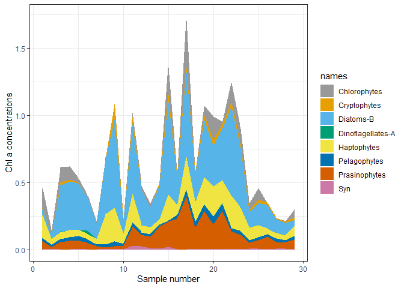

<!-- README.md is generated from README.Rmd. Please edit that file -->

# phytoclass

The *phytoclass* package uses non-negative matrix factorization and
simulated annealing to determine the chl a concentrations of different phytoplankton
groups from pigment concentrations.

The main function is 'Simulated annealing'. This can be used in conjuction with the cluster function, which clusters larger datasets. To understand how to use your own matrices instead of the default dataset, please see the example in the vignette. 

When setting up your matrices, it is important to ensure that pigments are in the same order in the Sm and Fm matrices. Chlorophyll a must be the final column.

There is a separate function when Divinyl chlorophyll a and Prochlorococcus are used. Here Divynl chlorophyll a must be the 2nd to last column (see 'Fp').

The 'Steepest Descent'function is similar to that of CHEMTAX, and is unconstrained by minimum and maximum values, unlike the simualted annealing function. I would use this with more caution. 

## Installation

It can be installed from CRAN with:

``` r
install.packages("phytoclass")
```

Or the development version from [GitHub](https://github.com/) with:

``` r
# install.packages("devtools")
devtools::install_github("AndyMcKenzieFromNZ/phytoclass")
```

## Example

For the built-in samples matrix Sm of pigment samples:

``` r
library(phytoclass)
set.seed("84545")

Results <- simulated_annealing(Sm, niter = 5)
#> 
#> Condition number = 390
#> Current error:  0.0283
#> Neighbour's error:  0.0283
#> Temperature (%):  99.1
#> [1] " "
#> Current error:  0.024
#> Neighbour's error:  0.024
#> Temperature (%):  98.21
#> [1] " "
#> Current error:  0.024
#> Neighbour's error:  0.0248
#> Temperature (%):  97.32
#> [1] " "
#> Current error:  0.024
#> Neighbour's error:  0.0266
#> Temperature (%):  96.45
#> [1] " "
#> Current error:  0.024
#> Neighbour's error:  0.0257
#> Temperature (%):  95.58
#> [1] " "

Results$RMSE
#> [1] 0.02402553
Results$MAE
#>          Per       X19but         Fuco         Neox          Pra         Viol 
#> 3.471209e-03 1.423318e-05 5.395220e-04 8.540243e-03 6.235006e-03 2.153819e-02 
#>       X19hex         Allo          Zea        Chl.b        Tchla 
#> 9.868784e-05 6.901592e-04 1.529518e-02 3.024765e-03 3.555499e-03
Results$Error
#>                 Per        X19but          Fuco          Neox           Pra
#> 1257  -2.016832e-04  2.555861e-05 -0.0089617928 -0.0088573156  0.0057854981
#> 1278  -4.000933e-04  5.070243e-05 -0.0177781490 -0.0050287416  0.0029692048
#> 1908  -2.629452e-04  3.332212e-05 -0.0116839694 -0.0022869672  0.0036127567
#> 1909  -2.343801e-04  2.970217e-05 -0.0104146790 -0.0020856447  0.0039330735
#> 1914  -5.734420e-05  7.267031e-06 -0.0025480900  0.0014803626  0.0022605199
#> 1915  -2.691132e-05  3.410378e-06 -0.0011958046  0.0015754724  0.0036692934
#> 5614   0.000000e+00 -1.441622e-05  0.0050548609 -0.0003748107  0.0039785042
#> 5647   0.000000e+00 -1.907135e-06  0.0006687121  0.0012341398  0.0020925046
#> 5653   0.000000e+00 -4.937718e-07  0.0001731347  0.0010131425  0.0011489899
#> 6770   0.000000e+00 -1.031987e-05  0.0036185272 -0.0009429398  0.0024941454
#> 8425   0.000000e+00 -4.826104e-06  0.0016922106 -0.0015747921  0.0009532809
#> 8426   0.000000e+00 -1.185224e-05  0.0041558352  0.0042948847  0.0015547195
#> 9538   0.000000e+00 -7.970628e-06  0.0027947972  0.0002394925  0.0018553239
#> 9568   0.000000e+00 -1.451985e-05  0.0050911975 -0.0001082795  0.0095320268
#> 9625  -8.283923e-05 -6.988029e-05 -0.0036809615  0.0042735702  0.0004537920
#> 9626   0.000000e+00 -5.766038e-06  0.0020217863 -0.0024167071  0.0143167572
#> 9838  -3.677364e-05  4.660196e-06 -0.0016340370 -0.0044467202  0.0057361770
#> 9839   0.000000e+00 -6.087732e-06  0.0021345842 -0.0027920763  0.0098255906
#> 9845  -3.619323e-06  4.586642e-07 -0.0001608246 -0.0033778541  0.0067249902
#> 9860   0.000000e+00 -3.437891e-06  0.0012054518 -0.0065380900  0.0035195542
#> 9861   0.000000e+00 -1.350248e-06  0.0004734470 -0.0055708210  0.0092787207
#> 9904  -2.734102e-05  3.464832e-06 -0.0012148983 -0.0039355274  0.0015618060
#> 9913  -3.292737e-05  4.172771e-06 -0.0014631278 -0.0017724637  0.0021516319
#> 9938   0.000000e+00 -1.236979e-05  0.0043373057  0.0063476391 -0.0001607775
#> 9980   0.000000e+00 -6.567464e-06  0.0023027958 -0.0029623708  0.0008925982
#> 10081  0.000000e+00 -5.246794e-06  0.0018397200 -0.0029268007  0.0102797984
#> 10082  0.000000e+00 -6.889093e-06  0.0024155710  0.0020369517  0.0047177666
#> 10089  0.000000e+00 -7.131170e-06  0.0025004522 -0.0003558590  0.0054162953
#> 10121  0.000000e+00 -1.334807e-05  0.0046803262 -0.0023168271  0.0041727702
#>                Viol        X19hex          Allo           Zea        Chl.b
#> 1257  -0.0024269941 -3.711938e-04 -4.409828e-04 -1.120497e-02  0.015353185
#> 1278  -0.0021616075 -7.363636e-04 -8.748092e-04 -2.370467e-03  0.002087823
#> 1908  -0.0067722402 -4.839452e-04 -5.749329e-04 -3.373919e-03  0.005189338
#> 1909  -0.0071833294 -4.313717e-04 -5.124750e-04 -4.215064e-03  0.006222377
#> 1914  -0.0075942703 -1.055408e-04 -1.253838e-04 -1.743049e-03  0.003904737
#> 1915  -0.0072936003 -4.952973e-05 -5.884194e-05 -5.185266e-03  0.006005577
#> 5614  -0.0026324549  2.093703e-04  2.487345e-04 -9.104614e-03  0.009501780
#> 5647  -0.0014681990  2.769778e-05  3.290531e-05 -3.594214e-04 -0.003185980
#> 5653   0.0006155274  7.171168e-06  8.519438e-06 -2.165362e-04 -0.003564019
#> 6770  -0.0024095732  1.498779e-04  1.780568e-04 -5.719746e-03  0.007581382
#> 8425  -0.0093803479  7.009066e-05  8.326859e-05  2.827730e-05  0.009681932
#> 8426  -0.0123283981  1.721330e-04  0.000000e+00  6.944515e-05  0.005687787
#> 9538  -0.0158033847  1.157593e-04  0.000000e+00  4.670183e-05  0.012753453
#> 9568  -0.0082235070  2.108753e-04  2.505225e-04 -9.037484e-03  0.004185448
#> 9625   0.0033144315 -9.905241e-05 -1.811290e-04 -2.966061e-04 -0.009022583
#> 9626   0.0006596631  8.374155e-05  9.948601e-05 -1.996796e-02  0.003618368
#> 9838   0.0031349282 -6.768114e-05 -8.040604e-05 -1.372653e-02  0.010039291
#> 9839  -0.0061039172  8.841360e-05  1.050365e-04 -8.019459e-03  0.002309205
#> 9845  -0.0039680721 -6.661290e-06 -7.913696e-06 -1.273194e-02  0.013087472
#> 9860  -0.0031299818  4.992932e-05  5.931665e-05 -8.148555e-03  0.015364147
#> 9861  -0.0044837767  1.960998e-05  2.329690e-05 -1.301483e-02  0.011566731
#> 9904  -0.0023630976 -5.032059e-05 -5.978149e-05 -3.089930e-03  0.007837740
#> 9913  -0.0027060704 -6.060215e-05 -7.199611e-05 -3.810046e-03  0.005754947
#> 9938   0.0012556180  1.796494e-04  2.134258e-04  7.247757e-05 -0.007040581
#> 9980  -0.0022312429  9.538085e-05  1.133136e-04 -2.360653e-03  0.007530935
#> 10081 -0.0054650329  7.620044e-05  9.052708e-05 -5.481875e-03 -0.002786379
#> 10082 -0.0028179810  1.000520e-04  1.188630e-04  4.036486e-05 -0.007959213
#> 10089  0.0005513200  1.035677e-04  1.230397e-04  4.178324e-05 -0.010184592
#> 10121 -0.0091840014  1.938572e-04  2.303048e-04 -7.841625e-03  0.015989165
#>              Tchla
#> 1257   0.130654395
#> 1278   0.259188462
#> 1908   0.170341134
#> 1909   0.151836089
#> 1914   0.037148723
#> 1915   0.017433690
#> 5614  -0.073695053
#> 5647  -0.009749185
#> 5653  -0.002524139
#> 6770  -0.052754676
#> 8425  -0.024670817
#> 8426  -0.060588115
#> 9538  -0.040745478
#> 9568  -0.074224805
#> 9625   0.053664909
#> 9626  -0.029475716
#> 9838   0.023822701
#> 9839  -0.031120203
#> 9845   0.002344670
#> 9860  -0.017574337
#> 9861  -0.006902406
#> 9904   0.017712059
#> 9913   0.021331008
#> 9938  -0.063233782
#> 9980  -0.033572568
#> 10081 -0.026821364
#> 10082 -0.035216723
#> 10089 -0.036454209
#> 10121 -0.068234694
Results$`F matrix`
#>                      Per X19but   Fuco   Neox    Pra   Viol X19hex   Allo
#> Prasinophytes     0.0000 0.0000 0.0000 0.0960 0.1734 0.0923 0.0000 0.0000
#> Chlorophytes      0.0000 0.0000 0.0000 0.0502 0.0000 0.0311 0.0000 0.0000
#> Cryptophytes      0.0000 0.0000 0.0000 0.0000 0.0000 0.0000 0.0000 0.3292
#> Diatoms-B         0.0000 0.0000 0.8244 0.0000 0.0000 0.0000 0.0000 0.0000
#> Dinoflagellates-A 0.7198 0.0000 0.0000 0.0000 0.0000 0.0000 0.0000 0.0000
#> Haptophytes       0.0000 0.2513 0.0637 0.0000 0.0000 0.0000 0.9634 0.0000
#> Pelagophytes      0.0000 0.3376 0.8734 0.0000 0.0000 0.0000 0.0000 0.0000
#> Syn               0.0000 0.0000 0.0000 0.0000 0.0000 0.0000 0.0000 0.0000
#>                      Zea  Chl.b Tchla
#> Prasinophytes     0.1305 0.6366     1
#> Chlorophytes      0.0228 0.2891     1
#> Cryptophytes      0.0000 0.0000     1
#> Diatoms-B         0.0000 0.0000     1
#> Dinoflagellates-A 0.0000 0.0000     1
#> Haptophytes       0.0000 0.0000     1
#> Pelagophytes      0.0000 0.0000     1
#> Syn               0.9694 0.0000     1
Results$`Class abudances`
#> NULL
Results$Figure
```


A line I wrote on my local computer  
